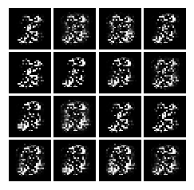

# Generative_Adversarial_Networks using nn.Sequential model

Generator Model:

`Generator (
  (main): Sequential (
    (0): Linear (100 -> 128)
    (1): ReLU (inplace)
    (2): Linear (128 -> 784)
    (3): Sigmoid ()
  )
)`

Discriminator Model:

`Discriminator (
  (main): Sequential (
    (0): Linear (784 -> 128)
    (1): ReLU (inplace)
    (2): Linear (128 -> 1)
    (3): Sigmoid ()
  )
)`

## Usage (to run python file)
```
usage: simpleGAN.py [-h] [--dataroot DATAROOT] [--batchSize BATCHSIZE]
                    [--imageSize IMAGESIZE] [--nz NZ] [--nepoch NEPOCH]
                    [--lr LR] [--netG NETG] [--netD NETD] [--outf OUTF]

optional arguments:
  -h, --help            show this help message and exit
  --dataroot DATAROOT   path to dataset
  --batchSize BATCHSIZE
                        input batch size
  --imageSize IMAGESIZE
                        the height / width of the input image to network
  --nz NZ               size of the latent z vector
  --nepoch NEPOCH       number of epochs to train for
  --lr LR               learning rate, default=0.001
  --netG NETG           path to netG (to continue training)
  --netD NETD           path to netD (to continue training)
  --outf OUTF           folder to output images and model checkpoints
```

Results : 
* **Before start of training** : 


* **After one iteration** : 


* **After two iterations** : 


* **After a hundred thousand iterations** : 


**Generator's Loss** : 

**Discriminator's Loss** : 
